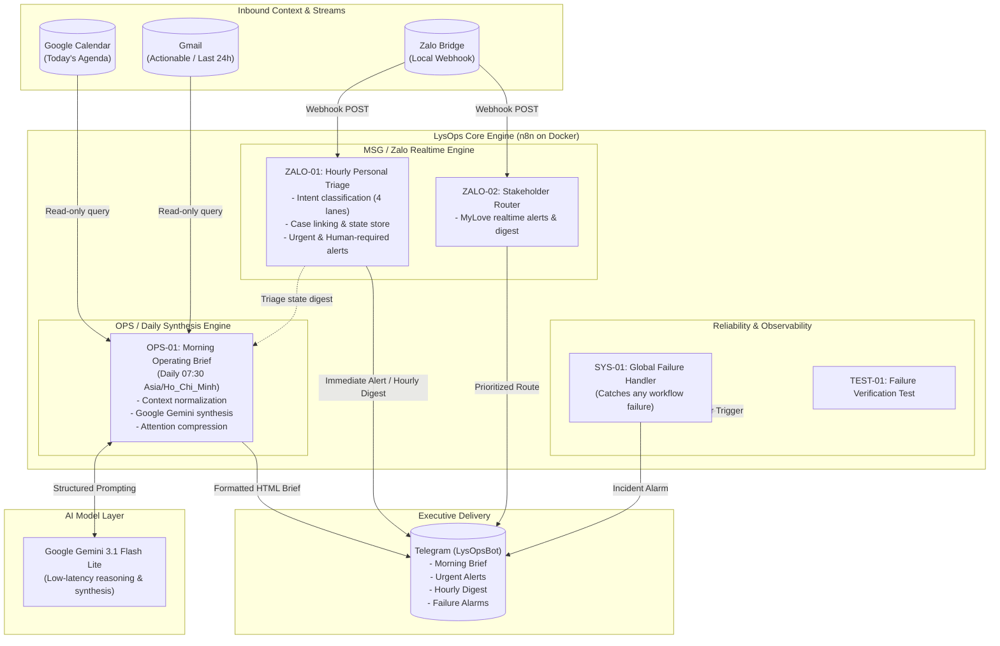

# LysOps — Personal Operations & Executive Automation Suite

[](https://n8n.io)
[](https://www.docker.com/)
[](https://ai.google.dev/)
[](https://telegram.org/)

**LysOps** is a privacy-first, event-driven personal operations system hosted locally on Docker/WSL2. It acts as an autonomous Chief of Staff and Executive Operations Assistant—synthesizing daily schedules, prioritizing actionable emails, triaging real-time chat messages, and delivering synchronized executive briefs directly to Telegram.

---

## Architecture Overview



---

## Core Workflows

| Identifier | Workflow Name | Trigger | Primary Purpose |
| :--- | :--- | :--- | :--- |
| **`OPS-01`** | **Morning Operating Brief** | `Cron (07:30 ICT daily)` | Aggregates Calendar, actionable Gmail, and communications triage into an executive daily briefing with top 3 priorities and noise suppression metrics. |
| **`ZALO-01`** | **Hourly Personal Communications Triage** | `Webhook` & `Hourly Cron` | Classifies incoming chat streams into 4 action lanes, tracks cases, issues immediate alerts for human decisions, and compiles an hourly digest. |
| **`ZALO-02`** | **MyLove Realtime Alert & Digest Router** | `Webhook` | Specialized router ensuring high-priority visibility for critical stakeholder conversations without information loss. |
| **`SYS-01`** | **Global Workflow Failure Handler** | `Error Trigger (Instance-wide)` | Intercepts workflow failures across n8n, extracts node stack traces and execution URLs, and dispatches incident alarms to Telegram. |
| **`TEST-01`** | **Failure Handler Test** | `Manual` | Synthetic failure trigger used to verify error alerting and Telegram dispatch pipelines end-to-end. |

---

## Key Design & Safety Principles

### 1. Strictly Read-Only Operations
`OPS-01` operates under strict zero-mutation constraints:
- **No Email Writes**: Never sends, forwards, or replies to emails.
- **No Calendar Mutating**: Never creates, reschedules, or deletes calendar entries.
- **No Chat Automated Replies**: Never impersonates the user on chat channels or executes unapproved financial or approval transactions.

### 2. Four-Lane Communications Triage
Inbound messages in `ZALO-01` are dynamically routed into strict operational lanes:
- `🔴 HUMAN-REQUIRED`: Polls, approvals, agreements, and financial decisions that strictly require the user's manual action.
- `🟡 AUTO-HANDLE`: Maintenance incidents, procurement tracking, senior assignments, and worker reports tracked into persistent cases.
- `✍️ DRAFT-FOR-YOU`: Casual inquiries and questions where suggested draft responses are generated for one-click user review.
- `🔕 IGNORE-DIGEST`: Low-signal background chatter, promotional messages, and non-actionable chatter automatically filtered from immediate view.

### 3. Unified Visual & Linguistic Identity
All Telegram dispatches share a consistent executive visual standard:
- **Badge Headers**: `🌅 MORNING OPS`, `🚨 ZALO TRIAGE`, `📬 ZALO BRIEF`, `🚨 WORKFLOW FAILED`.
- **Status Pills**: Fast at-a-glance counters (`📅 X lịch • 🔴 X cần bạn • 🟡 X quyết định / theo dõi • 🔕 X lọc`).
- **Telegram HTML Formatting**: Sanitized HTML (`<b>`, `<i>`, `<code>`) avoiding Markdown parsing conflicts with email addresses (`<user@domain>`) or mathematical symbols.

---

## Repository Structure

```
LysOps/
├── README.md                                  # Project overview and system documentation
├── .gitignore                                 # Ignores credentials, runtime state, and environment files
└── workflows/
    ├── OPS-01_morning_operating_brief.json    # Morning Operating Brief workflow definition
    ├── SYS-01_global_failure_handler.json     # Global error handling workflow definition
    ├── TEST-01_failure_test.json              # Synthetic failure test workflow
    ├── ZALO-01_hourly_triage.json             # Hourly communications triage workflow
    └── ZALO-02_mylove_alerts.json             # Dedicated stakeholder alert router
```

---

## Local Development & Operations

### Prerequisites
- Docker & Docker Compose on Linux / WSL2
- n8n v1.80+ container (`n8n-dev`)
- Local chat bridge container (`zalo-bridge` on port 5680)

### Configured Credentials
- **Telegram Bot API**: `LysOpsBot` (Chat ID: `8909610365`)
- **Google Gemini API**: Configured for `models/gemini-3.1-flash-lite`
- **Google Calendar OAuth2**: Read-only scope (`https://www.googleapis.com/auth/calendar.readonly`)
- **Gmail OAuth2**: Read-only scope (`https://www.googleapis.com/auth/gmail.readonly`)

### Running Workflows via CLI
When executing workflows via the n8n CLI inside the container, isolate the Task Broker port to prevent collision with the running server instance:

```bash
docker exec -e N8N_RUNNERS_BROKER_PORT=5699 n8n-dev n8n execute --id=OPS01MORNINGv1
```